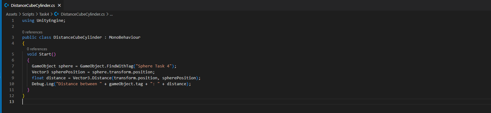

# Introducción a C# - Scripts

* **Alumno:** Adrián García Rodríguez
* **Correo:** alu0101557977@ull.edu.es

## Ejercicio 1

Script desarrollado:

Ejemplo ejecución:

▶️ [Ver en YouTube](https://youtu.be/HiO5tB8Gw9g)

## Ejercicio 2

Script desarrollado:

Ejemplo ejecución:

▶️ [Ver en YouTube](https://youtu.be/etcZJ1DLyoQ)

## Ejercicio 3

Script desarrollado:

Ejemplo ejecución:

▶️ [Ver en YouTube](https://youtu.be/gJ0HAHvTJFs)

## Ejercicio 4

Script desarrollado:

Ejemplo ejecución:

▶️ [Ver en YouTube](https://youtu.be/uTG4quHSSas)

## Ejercicio 5

Primer script desarrollado:

Segundo script desarrollado:

Ejemplo ejecución:

▶️ [Ver en YouTube](https://youtu.be/bUXbrtidY_Q)

## Ejercicio 6

Script desarrollado:

Ejemplo ejecución:

▶️ [Ver en YouTube](https://youtu.be/MWsKyxATAtg)

## Ejercicio 7

Realización del ejercicio:

▶️ [Ver en YouTube](https://youtu.be/91R9mh5PZr8)

## Ejercicio 8

Script desarrollado:

### Duplicar las coordenadas de la dirección del movimiento

Se duplica el desplazamiento, es decir, el cubo se mueve el doble por frame.

▶️ [Ver en YouTube](https://youtu.be/judkalSGbGw)

### Duplicar la velocidad manteniendo la dirección del movimiento

El objeto se mueve el doble de rápido, pero esta vez a causa del cambio de la velocidad.

▶️ [Ver en YouTube](https://youtu.be/wsPt6ZiKYaA)

### La velocidad es menor que 1

El movimiento es lento (menor desplazamiento por frame). En este caso (`0.5` de velocidad) se desplaza la mitad de rápido.

▶️ [Ver en YouTube](https://youtu.be/spdpje1ekDE)

### La posición del cubo tiene y > 0

El objeto se mueve a otra altura (en este caso `y = 4`), pero el patrón de movimiento no cambia.

▶️ [Ver en YouTube](https://youtu.be/InlC0vwiEzA)

### Intercambiar movimiento relativo al sistema de referencia local y el mundial.

En el sistema referencial local, el movimiento se orienta con el cubo, no con el mundo. Si se rota, cambia la dirección del desplazamiento.

▶️ [Ver en YouTube](https://youtu.be/El6Z2tWA3P4)

## Ejercicio 9

Primer script desarrollado:

Segundo script desarrollado:

Ejemplo ejecución:

▶️ [Ver en YouTube](https://youtu.be/Uf6xPtGH2h0)

## Ejercicio 10

Primer script desarrollado:

Segundo script desarrollado:

Ejemplo ejecución:

▶️ [Ver en YouTube](https://youtu.be/Cpj1NqKorNg)

## Ejercicio 11

Script desarrollado:

Ejemplo ejecución:

▶️ [Ver en YouTube](https://youtu.be/BP64ll7aKnA)

## Ejercicio 12

Script desarrollado:

Ejemplo ejecución:

▶️ [Ver en YouTube](https://youtu.be/WwvW2V59XBM)

## Ejercicio 13

Script desarrollado:

Ejemplo ejecución:

▶️ [Ver en YouTube](https://youtu.be/u_p2PYIGZaw)